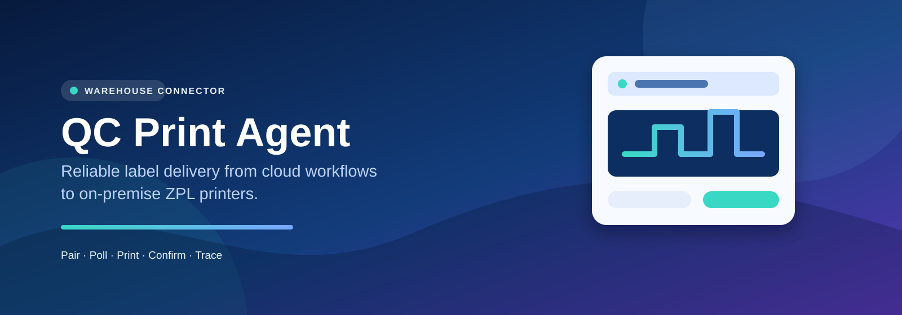
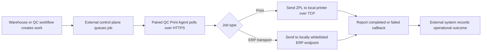
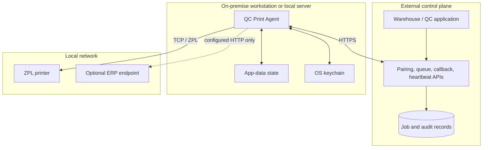

<p align="center">
  
</p>

<p align="center">A deployable workstation connector for dependable, traceable warehouse label printing.</p>

<p align="center">
  
  
  
  
  
</p>

<p align="center">
  <a href="#what-it-solves">What it solves</a> · <a href="#workflow">Workflow</a> · <a href="#capabilities">Capabilities</a> · <a href="#architecture">Architecture</a> · <a href="#deploy-and-operate">Operate</a> · <a href="#develop-locally">Develop</a>
</p>

## What it solves

QC Print Agent bridges a common warehouse and quality-control gap: business workflows may run in a hosted application, but thermal printers are reachable only on the local network. The agent runs at the workstation or site, receives work through a configured HTTPS control plane, sends ZPL to approved network printers over TCP, and reports the result back to the workflow.

It is a connector—not an ERP, WMS, CRM, printer fleet manager, or database. The product/UI, Supabase project, printer-job backend, and ERP are external systems that this agent integrates with.

| Operational problem | Connector response |
| --- | --- |
| A cloud workflow cannot directly access site printers. | An on-premise agent makes the final TCP connection to the printer. |
| Operators need repeatable workstation setup. | Pairing, local state, a GUI setup path, console fallback, and packaged binaries support deployment. |
| Multiple printers can receive labels at one station. | The agent processes configured concurrent jobs and sends each to its target printer. |
| Teams need to investigate an unprinted label. | Job results, failures, workstation identity, timestamps, and callback context flow back to the control plane and local logs. |
| An ERP request must not select arbitrary destinations from a cloud payload. | ERP transport uses a locally configured endpoint-key whitelist with retry, timeout, correlation, and idempotency handling. |

## Business value

- Keeps local printing close to the devices while retaining centralized workflow coordination.
- Reduces manual handoffs between a quality/warehouse workflow and the label printer.
- Makes workstation and job-level investigation possible when a print or callback fails.
- Supports a controlled hybrid topology: HTTPS outward to the control plane, raw TCP only inside the local network.

## Workflow



### End-to-end operator journey

1. An administrator provisions a workstation with approved bootstrap configuration and a pairing code through the external control plane.
2. The agent starts; an unpaired packaged app opens its setup wizard. Console pairing is also available.
3. The paired agent verifies registration, loads non-secret state from local app data, retrieves credentials from the OS keychain when available, and starts polling.
4. For a print job, the agent sends the supplied ZPL to the job’s configured printer address and port.
5. For an enabled ERP request, the agent resolves an endpoint key against local configuration, applies the configured authentication mode, and retries transient failures.
6. The agent sends a success or failure callback. The control plane remains the system of record for queue state and business outcomes.
7. Operators use local logs, agent status, and the external application’s records to investigate exceptions or reconnect a workstation.

## Capabilities

| Capability | Implemented here | External dependency / boundary |
| --- | --- | --- |
| ZPL label delivery | TCP socket delivery; configurable port and timeout | Reachable printer and local network policy |
| Concurrent printing | Thread-pool execution with configurable `MAX_CONCURRENT_JOBS` | Backend must claim work safely when printers/workstations are shared |
| Pairing and lifecycle | GUI setup wizard, console fallback, reconnect/reset flow, heartbeat and registration checks | Pairing, heartbeat, config, and registration endpoints |
| Local credential handling | OS keyring integration plus non-secret app-data state | Keyring backend available on the workstation |
| ERP transport | Local endpoint whitelist, optional auth, retry and idempotency headers | ERP endpoint and configuration owned by the deployment |
| Packaged distribution | PyInstaller spec, Windows/macOS CI build jobs, first-run pairing behavior | Platform signing, distribution, and installer policy |
| Queue correctness | Agent consumes jobs and reports outcomes | Atomic claiming, stale-job recovery, printer exclusivity, and database schema belong in the external backend |

## Evidence, audit, and traceability

The agent provides transport-level evidence rather than replacing the business system of record:

- A persistent workstation identifier is included in control-plane requests.
- Job callbacks can include message ID, correlation ID, workstation ID, and processed timestamp.
- ERP requests carry correlation and idempotency headers and use the same payload across retry attempts.
- Local logs record operational events; configure their location carefully because job payloads and label content can be sensitive.
- The external control plane should retain queue state, job status, and business/audit records.

The agent intentionally does not derive ERP counting statuses or recompute operational totals. The backend-facing contract and multi-printer claiming requirements are documented in [Lovable integration requirements](docs/lovable-requirements.md).

## Roles and user groups

This codebase does not implement application RBAC or user accounts. In a typical deployment:

| Group | Responsibility |
| --- | --- |
| Warehouse / QC operator | Keeps the station online, runs controlled print checks, and reports exceptions. |
| Site or IT administrator | Installs the connector, provisions local configuration, printer/firewall access, and workstation pairing. |
| Control-plane team | Owns the queue, pairing APIs, authorization, database rules, and operational records. |
| ERP integration owner | Owns allowed ERP endpoints, credentials, idempotency semantics, and downstream business validation. |

## Integrations

- **Control plane:** configured HTTPS endpoints for pairing, job polling, callbacks, heartbeat, and registration status. Existing documentation assumes a Supabase edge-function implementation, but no Supabase source or migrations are included here.
- **Network printers:** ZPL over raw TCP, normally on a site-local printer port such as `9100`.
- **ERP:** an optional, locally configured HTTP integration. The agent does not accept arbitrary ERP URLs from remote jobs.
- **Operating system services:** OS keyring support for secrets; local app-data storage for non-secret pairing/runtime state.

## Architecture



## Technology choices

| Area | Choice | Why it fits |
| --- | --- | --- |
| Runtime | Python 3.10+ | Portable workstation-agent runtime. |
| HTTP | `requests` | Control-plane and ERP transport with explicit timeout/retry behavior. |
| Printer protocol | Raw TCP with ZPL payloads | Direct delivery without exposing printers to the internet. |
| Concurrency | `ThreadPoolExecutor` | Bounded parallel processing for multiple target printers. |
| Secret storage | `keyring` | Uses platform credential facilities after pairing where supported. |
| Packaging | PyInstaller | Produces Windows and macOS distribution artifacts. |
| Tests | `unittest` plus request/socket mocks | Covers pairing, installer flow, ERP transport, callbacks, and print outcomes. |

## Lovable and backend boundary

The repository contains [requirements for a Lovable/Supabase team](docs/lovable-requirements.md), not Lovable-generated application source. That document specifies the backend work needed for atomic job claims, printer exclusivity, stale-job recovery, and edge-function contract updates. Keep that work reviewed and versioned with the external control plane; do not represent it as implemented by this repository.

## Deploy and operate

This agent is designed for on-premise or hybrid operation. A cloud-only deployment cannot reach printers confined to a warehouse network.

- **Windows/macOS workstation:** build and distribute the packaged app; first launch on an unpaired device opens setup.
- **Linux/local server:** run the Python source under a dedicated service account and service manager.
- **Hybrid:** give the agent outbound HTTPS access to its control plane and local TCP access to approved printers; it does not require inbound internet access.

See [Deployment and safe updates](docs/DEPLOYMENT.md) for configuration, service guidance, validation, rollback, and the update lifecycle. See [Background mode](docs/BACKGROUND_MODE.md) for `--daemon`, `--status`, and `--stop` operations.

### Safe upgrades

1. Review the release and back up current local configuration outside Git.
2. Validate new configuration before deployment; deliver secrets through an approved channel.
3. Stop the agent cleanly, deploy the application, and coordinate external forward migrations with the control-plane owner.
4. Start the agent, verify registration, execute a controlled print, and confirm the callback.
5. If validation fails, restore the prior application version while preserving configuration and external records.

Persistent database data belongs to the external control plane. This repository does not create or migrate it, and connector rollback does not delete it.

## Develop locally

Prerequisites: Python 3.10+ and network access only to approved test services/printers.

```bash
python -m venv .venv

# Windows PowerShell
.\.venv\Scripts\Activate.ps1

# Linux/macOS
# source .venv/bin/activate

python -m pip install --upgrade pip
pip install -r requirements.txt
```

Create a local configuration without committing it:

```bash
copy .env.example .env  # Windows
# cp .env.example .env  # Linux/macOS
```

Set the required values in `.env`, then run a supported entrypoint:

```bash
python print_agent.py
python print_agent.py --setup
python print_agent.py --console
python print_agent.py --test-print <PRINTER_IP>
python print_agent.py --test-erp <ENDPOINT_KEY>
python print_agent.py --daemon
```

For controlled validation, use the [Windows runbook](WINDOWS_RUNBOOK.md), [Linux/macOS runbook](LINUX_RUNBOOK.md), and [smoke-test contract](SMOKE_TEST.md). Do not use production printers or credentials for unreviewed local changes.

## Repository map

```text
.
├── print_agent.py                 # Runtime, pairing UI, print and ERP transport
├── diagnose.py                    # Configuration-driven local diagnostics
├── test_*.py                      # Unit and mocked integration coverage
├── .env.example                   # Safe public configuration template
├── print_agent.spec               # PyInstaller packaging definition
├── build.bat / build.sh            # Local Windows and macOS build helpers
├── .github/workflows/build.yml    # Windows/macOS release-artifact workflow
├── docs/
│   ├── DEPLOYMENT.md               # Deployment, upgrade, and rollback guidance
│   ├── PUBLICATION_CHECKLIST.md    # Public-repository safety checks
│   ├── BACKGROUND_MODE.md          # Background operation reference
│   ├── PACKAGED_APP_BEHAVIOR.md    # First-run and pairing behavior
│   └── lovable-requirements.md     # External backend requirements
└── WINDOWS_RUNBOOK.md, LINUX_RUNBOOK.md, SMOKE_TEST.md
```

## Documentation

| Document | Use it for |
| --- | --- |
| [Deployment and safe updates](docs/DEPLOYMENT.md) | Configuration, network topology, service operation, upgrades, rollback. |
| [Publication checklist](docs/PUBLICATION_CHECKLIST.md) | Secret scanning, release-artifact review, credential rotation, history assessment. |
| [Packaged app behavior](docs/PACKAGED_APP_BEHAVIOR.md) | First-run setup, pairing reset, local state/log locations. |
| [Background mode](docs/BACKGROUND_MODE.md) | Daemon lifecycle and service-manager examples. |
| [Lovable integration requirements](docs/lovable-requirements.md) | Required external queue-claiming and edge-function behavior. |
| [Smoke test](SMOKE_TEST.md) | Expected print-agent contract and controlled validation. |

## Usage and license

No license file is currently included. Do not assume permission to reuse, distribute, or modify this code outside rights granted by its copyright holder. Add an explicit license before publishing it as open source.

## Demo and contact

No public demo URL, business email, or website was found in the repository, so none is published here. For repository-scoped questions or defect reports, use [GitHub Issues](https://github.com/asaboormalik-pm/qc-app/issues).

## Publication note

Before public release, complete the [publication checklist](docs/PUBLICATION_CHECKLIST.md). Review historic commits and existing release artifacts for earlier credential or infrastructure exposure; this change does not rewrite Git history or rotate external credentials.
