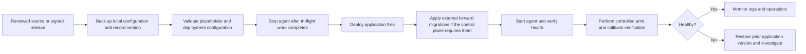

# Deployment and Safe Updates

QC Print Agent runs beside the printers it serves. The hosted control plane remains external; this repository does not deploy a database, Supabase project, ERP, or printer firmware.

## Deployment models

| Model | Supported by this repository | Appropriate use |
| --- | --- | --- |
| Workstation / on-premise | Packaged Windows executable or macOS app | A station with network access to local ZPL printers. |
| Local server | Python source with a service manager | A durable site host serving one or more printers. |
| Hybrid | On-premise agent plus HTTPS control plane | The normal topology: cloud workflow coordination, local raw-TCP printing. |

The agent needs outbound HTTPS access to the configured control-plane endpoints and TCP access to approved printer addresses. It does not need inbound internet access. Configure firewall rules using the actual local printer port (default `9100`); do not publish printer services to the internet.

## Provision configuration safely

1. Obtain bootstrap values through an approved secret-delivery channel.
2. Copy `.env.example` to `.env` beside the source or packaged application.
3. Set `PRINT_AGENT_CALLBACK_URL` and `PRINT_AGENT_API_KEY`; set ERP values only when the ERP flow is enabled.
4. Keep `.env` readable only by the service account or workstation administrator.
5. Start the packaged application to pair the workstation, or use `--setup` / `--console` to reopen pairing.

`.env` is intentionally ignored by Git. Packaged CI artifacts contain only the placeholder `.env.example`; never inject shared keys or production endpoints into public release archives.

On paired machines, the agent stores non-secret state under the platform app-data directory and uses the operating-system keychain for credentials. The exact state paths are documented in [PACKAGED_APP_BEHAVIOR.md](PACKAGED_APP_BEHAVIOR.md).

## Run as a service

For a local Linux host, create a dedicated service user, install dependencies in a virtual environment, and use a service manager. The source supports `--daemon`, `--status`, and `--stop`; [BACKGROUND_MODE.md](BACKGROUND_MODE.md) has operational details. Windows and macOS packaging is defined by `print_agent.spec` and the build scripts.

## Safe update lifecycle

Follow this order for every production update:

### Before deployment

- Review the release diff and its configuration requirements.
- Back up the existing `.env` and record the previous application version. Do not put the backup in the repository.
- Confirm printer reachability, DNS, HTTPS control-plane access, and available disk space for logs.
- Coordinate any Supabase/database migration with the owner of the external control plane. This repository contains no executable migrations.

### After deployment

- Run `--status` where applicable and inspect startup logs.
- Verify one approved test job reaches the correct printer and receives a completion callback.
- If ERP is enabled, test one non-production request path with the configured endpoint whitelist.
- Monitor for failed callbacks, retry activity, and duplicate-job symptoms before returning the station to normal use.

## Rollback and data preservation

Rolling back this connector replaces only application files. It does not delete or migrate the external database, queued records, printer data, local pairing state, or operating-system keychain credentials. If an update fails, stop the new binary, restore the previous tested application package, retain the existing `.env`, and validate a controlled job.

Do not roll back external forward migrations without a migration-specific recovery plan from the control-plane owner.
